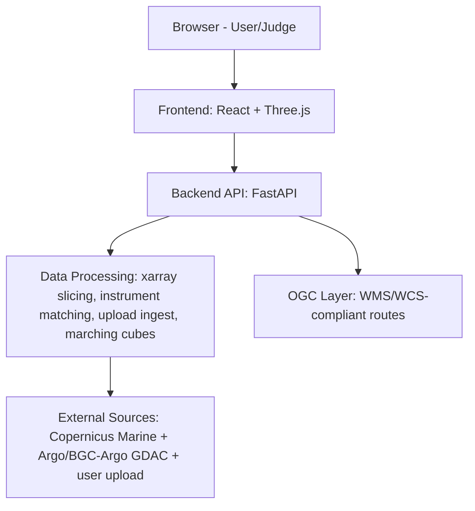
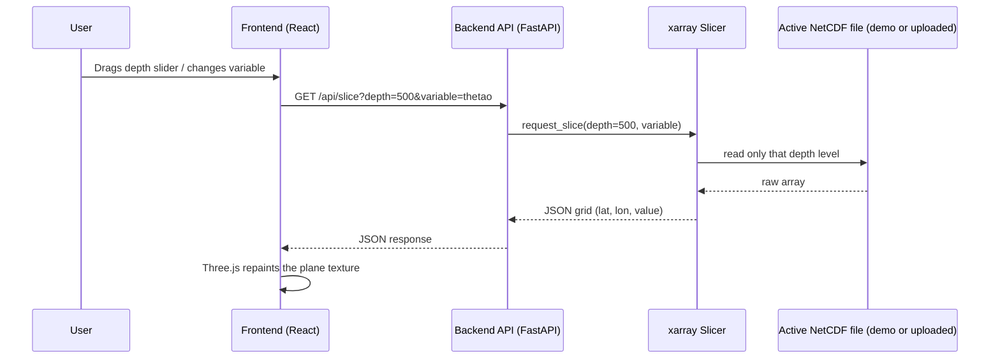

# Ocean 3D Visualization Platform — Architecture & Build Plan
**SIH PS 26067 — INCOIS 3D Ocean Data Visualization System**

> Any AI coding agent working on this repo MUST read this file first, and
> MUST NOT implement a phase that isn't the current target phase.

---

## 0. Git Setup

- Remote: `https://github.com/Tanishktewetia/incois-ocean-3d-viz.git`
- Branch: `main`
- Identity for commits: username `Tanishktewetia`, email `tanishktewetia@gmail.com`
- **Push after every phase:**
  ```
  git add -A
  git commit -m "Phase N: <short description>"
  git push
  ```
  (First push only, if remote isn't set yet:)
  ```
  git remote add origin https://github.com/Tanishktewetia/incois-ocean-3d-viz.git
  git branch -M main
  git push -u origin main
  ```

---

## 1. The Idea, End to End

A judge opens the site in a browser. A rotatable 3D block of the Indian
Ocean EEZ is shown, colored by a chosen variable (temperature, salinity, or
currents). A depth slider moves through the water column. A time
slider/play button animates several days of forecast data. A colorbar
panel lets the user change the variable, adjust the min/max range, switch
log/linear scale, adjust layer opacity, and stretch the vertical axis. A
true isosurface-extraction toggle renders a 3D surface mesh at a chosen
threshold value using marching cubes — not an approximation. Small dots on
the scene are real Argo float locations, extended to also show BGC-Argo
(chlorophyll/oxygen) and a labelled sample Glider/CTD dataset — clicking
any point opens a chart comparing it against the model, with an RMSE
score. A toggle switches on animated current-vector particles driven by
real u/v data. A scientist can upload their own NetCDF file instead of the
bundled demo dataset. The backend also exposes OGC-compliant WMS/WCS
endpoints so the system is interoperable with standard GIS tooling, as the
PS explicitly asks for.

The app also has a **dedicated context page** (§7, Phase 13) whose job is
to make sure a judge who has never seen this project understands, within
seconds, what problem it solves and why it's better than what INCOIS
scientists use today.

**Non-goal (the only one — everything else in the PS is being built):**
photorealistic water rendering / fluid physics / wave-foam shaders. The PS
itself doesn't ask for this — it asks for accurate data visualization, not
a realistic ocean surface.

---

## 2. Dataset — Final Decision

**Model data (temperature, salinity, currents):**
- Source: Copernicus Marine Service
- Product: `GLOBAL_ANALYSISFORECAST_PHY_001_024`
- Variables: `thetao` (temperature), `so` (salinity), `uo`/`vo` (currents)
- Region: lon 68–90, lat 5–22 (India EEZ bounding box), always subset.
- Access: `pip install copernicusmarine`, free account, `copernicusmarine
  subset` CLI.

**In-situ / instrument data:**
- **Argo floats (temp/salinity):** Argo GDAC — `https://data-argo.ifremer.fr`
- **BGC-Argo (chlorophyll/oxygen):** same GDAC, BGC-Argo profiles — real
  data, no separate source needed.
- **Glider / CTD:** public, India-EEZ-specific live feeds are not reliably
  available. Phase 9 uses a small, clearly-labelled sample dataset
  ("sample data — for demonstration; architecture accepts a live feed via
  the same ingestion path") rather than fabricating unlabelled data. This
  is an honesty requirement, not a shortcut — a judge who asks "is this
  real?" must get a true answer.
- All in-situ sources use a historical 7-day window matching the model
  subset's dates, so RMSE (Phase 6) is meaningful.

---

## 3. Tech Stack

| Layer | Choice | Why |
|---|---|---|
| Backend | Python, FastAPI | Fast to build, native xarray/NetCDF support |
| Data handling | xarray + netCDF4 | Standard for slicing NetCDF without loading whole file |
| Frontend framework | React + Vite | Fast dev loop, easy state management for sliders |
| 3D rendering | Three.js (+ `MarchingCubes` from three/examples/jsm) | Native isosurface support, avoids a custom implementation |
| Charting | Chart.js | Depth-profile charts |
| Data store | SQLite or flat JSON | Instrument metadata |
| Standards layer | Custom minimal WMS/WCS-compliant routes | Satisfies OGC interoperability requirement without a full GeoServer deployment |

---

## 4. High-Level Architecture (HLD)



---

## 5. Low-Level Design (LLD) — Slice Request Flow



---

## 6. Repository Structure

```
ocean-viz/
├── ARCHITECTURE.md
├── backend/
│   ├── main.py
│   ├── data/                   demo .nc files
│   ├── uploads/                 user-uploaded files (Phase 8)
│   ├── services/
│   │   ├── slicer.py            xarray slicing, variable-generic
│   │   ├── instruments.py       Argo + BGC-Argo + Glider/CTD sample, unified schema
│   │   ├── rmse.py              model vs sensor comparison
│   │   ├── ingest.py            Phase 8: upload validation + parsing
│   │   ├── isosurface.py        Phase 11: marching-cubes mesh generation
│   │   └── ogc.py               Phase 12: WMS/WCS response builders
│   └── routers/
│       ├── ocean.py             /api/slice, /api/layers
│       ├── instruments.py       /api/instruments, /api/instruments/{id}/profile
│       ├── upload.py            /api/upload
│       ├── isosurface.py        /api/isosurface
│       └── ogc.py               /wms, /wcs
├── frontend/
│   ├── src/
│   │   ├── App.jsx
│   │   ├── components/
│   │   │   ├── HeatmapCanvas.jsx        Phase 2
│   │   │   ├── OceanScene3D.jsx         Phase 3
│   │   │   ├── DepthTimeSlider.jsx      Phase 4
│   │   │   ├── InstrumentOverlay.jsx    Phase 5, extended Phase 9
│   │   │   ├── ProfileChart.jsx         Phase 5
│   │   │   ├── UploadPanel.jsx          Phase 8
│   │   │   ├── VariableControls.jsx     Phase 10
│   │   │   ├── IsosurfacePanel.jsx      Phase 11
│   │   │   └── ContextPage.jsx          Phase 13
│   │   └── api/client.js
└── PHASE_LOG.md
```

---

## 7. Build Phases

### Phase 0 — Scaffolding
FastAPI `/health` + Vite React app that shows "Backend connected".

### Phase 1 — Data Slicing API
`/api/slice?depth=0&variable=thetao`. Test: numbers look like real
temperatures.

### Phase 2 — Flat 2D Heatmap
Render Phase 1's grid on canvas. Test: matches known ocean geography.

### Phase 3 — 3D Depth Stack
`/api/layers`, Three.js planes stacked on Z. Test: rotate, colder at depth.

### Phase 4 — Depth / Time Slider
Test: dragging changes the view smoothly.

### Phase 5 — Argo Overlay + Profile Chart *(in progress)*
`/api/argo`, `/api/argo/{id}/profile`. Test: click a dot, get a sensible
chart.

### Phase 6 — Model vs Sensor RMSE
Test: value changes sensibly per float; sanity-check one by hand.

### Phase 7 — Current Vector Particles
Test: particles follow real current direction, not random motion.

### Phase 8 — Scientist Data Upload
`/api/upload` accepts a `.nc` file, validates variable names, runs through
the same `slicer.py`. Frontend toggle: "Demo dataset" vs "My upload". Test:
re-upload the demo file, scene renders identically to the cached path.

### Phase 9 — Multi-Instrument Overlay (Argo + BGC-Argo + Glider/CTD)
- Extend the instrument overlay beyond Argo temp/salinity to also plot
  **BGC-Argo** chlorophyll/oxygen profiles (real GDAC data).
- Add a **Glider/CTD** overlay using a small labelled sample dataset (see
  §2), visually distinguished (different marker shape/color) and tagged
  "sample data" in its tooltip — never presented as live.
- Unify all instrument types under one schema in `instruments.py` so a
  real Glider/CTD feed can be swapped in later with no frontend change.
- Test: all three marker types appear with correct, distinct styling and
  clicking any of them opens the right profile chart.

### Phase 10 — Variable & Colorbar Controls
- Variable selector: `thetao` / `so` / current magnitude.
- Editable colorbar min/max range.
- Log/linear scale toggle.
- Layer opacity slider.
- Vertical exaggeration slider.
- Test: switching variables changes scene colors/values correctly; range
  and log/linear changes visibly affect coloring; exaggeration visibly
  stretches depth.

### Phase 11 — True Isosurface Extraction
- Use Three.js's `MarchingCubes` (from `three/examples/jsm/objects/`) over
  the volumetric grid (interpolated between the depth layers) to generate
  a real 3D surface mesh at a user-chosen threshold value.
- A slider sets the threshold; the mesh regenerates as it moves.
- Test: moving the threshold produces a visibly different, correctly
  shaped surface (e.g., a warm-water "blob" that shrinks as the threshold
  rises).

### Phase 12 — OGC WMS/WCS-Compliant Endpoints
- `/wms?REQUEST=GetCapabilities` — valid capabilities XML describing
  available layers (variables/depths/times).
- `/wms?REQUEST=GetMap&...` — returns a rendered PNG tile for a given
  variable/depth/time/bbox (reuse slicer output, render via
  matplotlib/PIL).
- `/wcs?REQUEST=DescribeCoverage` and `GetCoverage` — return a subset as
  NetCDF/GeoTIFF.
- This does not need to support every OGC edge case — it needs to be
  correct for the parameters this app actually uses, and testable in
  QGIS or a WMS client as evidence of real interoperability.
- Test: add the `/wms` endpoint as a layer source in QGIS (or similar) and
  confirm a tile renders.

### Phase 13 — Polish & Demo Packaging
**13a. Visual polish**
- Dark theme, consistent spacing, colorbar legend with real labels, axis
  labels, loading states.
- Every interactive control gets a short inline label/tooltip.
- **Layout reference (arrangement only, not visual style):** a team
  mockup suggested a clean panel arrangement — left sidebar with variable
  selector buttons (Temperature/Salinity/Currents), colorbar with real
  min/max numbers on the right, depth slider, opacity slider, vertical
  exaggeration slider, a small region mini-map in a corner, and
  rotate/pan/zoom/reset controls along the bottom. Use this as a spacing
  and arrangement reference for the existing real controls.
  **Do NOT add a photorealistic seafloor terrain, dramatic lighting, or
  any fabricated bathymetry/canyon geometry** — the project's core value
  is fast, reliable, data-accurate visualization for scientists, not
  visual realism. Every surface rendered must trace back to an actual
  data value; nothing decorative that isn't backed by real or user data.
- Known small UX issues to fix here specifically (batched on purpose,
  not fixed piecemeal earlier, to avoid re-touching layout repeatedly):
  - 3D canvas is small and off-center; needs a full-width/responsive,
    centered layout.
  - Enable middle-mouse-button drag to pan the 3D camera (separate from
    left-drag rotate and scroll-wheel zoom) via the existing OrbitControls
    instance.
  - Chart and 3D scene should sit side-by-side on wide screens instead of
    stacked, to reduce scrolling.
  - Background/contrast pass so colors read clearly instead of looking
    washed out against the dark background.

**13b. Dedicated context page** (`/about`)
- Problem statement, one line.
- Before/after comparison (old multi-tool workflow vs this platform).
- Guided callouts on the main app.
- Impact statement.
- A short "PS requirement coverage" list — since essentially every bullet
  in the official PS is now implemented, state that plainly (variable
  selector, colorbar controls, isosurfaces, multi-instrument overlay,
  upload ingestion, OGC endpoints, RMSE comparison, outreach-ready UI).

Also write `README.md` and `DEMO_SCRIPT.md`.

### Phase 14 — Comparison & Justification Page (researched, cited)
A dedicated section/page proving, with real documentation, why OceanScope
is a genuine improvement over the three tools scientists use today. Every
factual claim on this page must trace to one of the sources below or be
flagged for the user to verify — no invented statistics, no unverified
claims. This phase must not proceed on assumptions; the research below
was gathered from each tool's own documentation.

**Ferret (NOAA PMEL)**
- Command-line/scriptable environment, development began 1985.
  Source: https://ferret.pmel.noaa.gov/static/Documentation/rostock_paper/paper.html
- Primary format is NetCDF; can also ingest ASCII/binary. Defines new
  variables via typed mathematical expressions ("Mathematica-like");
  produces plots (line, contour, vector, wireframe) via commands, not a
  persistent interactive 3D scene.
  Source: https://ferret.pmel.noaa.gov/Ferret/documentation/users-guide/data-set-basics/NETCDF-DATA
- No native web/browser interface (a separate later project, Live Access
  Server, added web access to Ferret's outputs).
  Source: https://en.wikipedia.org/wiki/Ferret_Data_Visualization_and_Analysis

**ODV — Ocean Data View (AWI, R. Schlitzer)**
- Desktop software, used by 25,000+ scientists; built for point/profile,
  time-series, and trajectory data (e.g., Argo floats), with two
  weighted-averaging gridding methods plus DIVA gridding.
  Source: https://odv.awi.de/
- Supports NetCDF (CF/COARDS/GDT/CDC) and its own ODV spreadsheet ASCII
  format; can directly import Argo, WOCE, GTSPP, World Ocean Database.
  Source: https://www.bodc.ac.uk/resources/delivery_formats/odv_format/
- Desktop application; not browser-native, no built-in 3D volumetric
  model-field rendering (it visualizes point/profile data and gridded
  2D/section fields, not a full interactive 3D water-column volume).

**MATLAB (community oceanography toolboxes, not one unified tool)**
- No single official "ocean viewer" — scientists assemble scripts from
  separate community toolboxes: e.g. the Argo Toolbox (fetches/imports
  Argo NetCDF into the MATLAB workspace), SEA-MAT (mapping, seawater
  properties, mooring tools), NCTOOLBOX (reads NetCDF/OPeNDAP/GRIB), and
  ocean_data_tools (builds uniform structs from Argo/glider/model data).
  Sources: https://www.mathworks.com/matlabcentral/fileexchange/54503-argo-toolbox ,
  https://sea-mat.github.io/sea-mat/ ,
  https://polar.ncep.noaa.gov/global/examples/usingmatlab2.shtml ,
  https://github.com/lnferris/ocean_data_tools
- Requires programming for every new analysis; no out-of-the-box
  co-display of model fields and instrument profiles.

**The common, citable gap (this is OceanScope's actual justification):**
All three are desktop or command-line tools. None natively run in a
browser. None co-visualize gridded model fields and real in-situ
instrument profiles (Argo/BGC-Argo/Glider/CTD) in one interactive 3D
scene with click-to-compare — a scientist must open a separate tool per
data type and correlate results manually, which is exactly the
"toggling between disparate software packages" problem the PS describes.

**Page content:**
- A clearly-sourced summary table: tool, primary use, data format(s),
  interface type, and whether it does 3D co-visualization — each row
  linking to its real source above.
- A short, honest "what OceanScope adds" statement grounded only in
  what's actually built (browser-native 3D, real Argo/BGC-Argo overlay,
  RMSE comparison, upload ingestion, OGC endpoints) — no exaggerated or
  unverifiable claims.
- Screenshots of OceanScope's own working features as the proof, since
  the team does not have rights to reproduce the other tools' UI.

**Manual test:** every claim on this page must be traceable to a source
above; if the agent adds any claim not covered by this research, it must
flag it for the user to verify rather than publishing it.

### Phase 15 — Multi-Dataset Upload & External Hazard Overlays

**15a. Multi-dataset upload**
Extend Phase 8's single temperature-only upload into independent upload
slots for each data type, matching the PS's "ingest new observational
data streams or additional model variables" requirement more fully:
- Temperature (`thetao`), Salinity (`so`), Currents (`uo`/`vo`) — each
  validated independently against the same `(time, depth, latitude,
  longitude)` coordinate contract used today, but not required to share
  the same grid/extent as each other (a scientist may only have some of
  these).
- An instrument/point-data upload (CSV or NetCDF) with columns/variables
  for latitude, longitude, depth, time, and one or more measured
  values, parsed into the same unified instrument schema as Phase 9.
  Tag this data `data_status=uploaded` (distinct from `sample` and from
  GDAC `real`) so its provenance is always honest and visible.
- The active region shown in the 3D scene must derive from whichever
  dataset(s) are currently active, never a hardcoded India EEZ box —
  this already works for the existing temperature upload and must
  continue to work as more upload types are added.
- UI: extend Data Lab with independent, optional upload slots per data
  type, each with its own validation status.

**15b. External hazard/advisory overlays**
- **Cyclone tracking (build now — verified):** Integrate the GDACS
  public API (`https://www.gdacs.org/gdacsapi/api/Events/geteventlist/EVENTS4APP`,
  no API key required, JSON/GeoJSON, event_type=TC for tropical
  cyclones) to show any active cyclone whose position falls within or
  near the India EEZ region as a marker/track on the 3D scene, directly
  supporting the PS's "hazard assessment" line.
  Source: https://www.gdacs.org/documents/2025/GDACS_MHEWS_guide.pdf
- **PFZ (fishing zone) advisory (conditional — verify first):** INCOIS
  publishes Potential Fishing Zone advisories via a WebGIS at
  `https://incois.gov.in/geoportal/MFASPFZ/index.html`. No public JSON
  API for this was confirmed during research. Before building anything
  user-facing, the agent must check whether this service (or
  `https://incois.gov.in/gisserver/PFZ/index.html`) exposes a reachable
  REST/ArcGIS endpoint. If yes, integrate it with clear source
  attribution. If no reachable public endpoint exists, do not fabricate
  or approximate this data — skip the feature and note it in
  PHASE_LOG.md as a verified gap for future work, not something built.

**Manual test:**
1. Upload each data type independently (or a subset) and confirm the
   3D scene, colorbar, and region all update to match, without needing
   every type present at once.
2. Confirm any active real cyclone from GDACS appears correctly
   positioned when relevant; confirm the app behaves gracefully (no
   crash, clear "no active cyclone" state) when there is none.
3. Confirm PFZ is either genuinely live-linked with a real source
   citation, or absent with an honest note in PHASE_LOG.md — no
   placeholder or fabricated fishing-zone shapes.

### Phase 16 — Real Seafloor Bathymetry
The 3D scene's floor is currently a flat plane, which reads as a blocky
placeholder next to reference visualizations that show real seafloor
relief. This phase adds that relief using real, measured, public data —
it does not conflict with the earlier ban on fabricated terrain, because
GEBCO bathymetry is actual sounding/satellite-derived seafloor
measurement, not invented geometry.

- Source: GEBCO gridded bathymetry
  (https://www.gebco.net/data-products/gridded-bathymetry-data), public
  domain, NetCDF, subsettable via their download app or OPeNDAP for the
  existing 68–90°E, 5–22°N India EEZ box.
- Download and cache one subset covering the app's fixed region (a
  regional subset is a few MB, not the multi-GB global grid).
- Render it as the base/floor mesh of the existing 3D volume — displace
  a plane's vertices by the real depth values (downsampled to a
  reasonable mesh resolution for performance), replacing today's flat
  bottom, styled consistently with the rest of the scene (not
  photorealistic terrain shading).
- This must not replace or alter the temperature/salinity/current
  layers, isosurface, particles, or instrument markers — it is purely
  the seafloor beneath them.
- Cite GEBCO exactly as their attribution requires (see architecture
  citation in this section) wherever the bathymetry layer is mentioned
  in the UI (e.g. a small "Seafloor: GEBCO bathymetry" caption).

**Manual test:** rotate the scene and confirm the floor now shows real
terrain relief (e.g. deeper trench-like areas, continental shelf
shallowing near the coast) instead of a flat plane, and that this holds
up whether viewing the demo dataset or an uploaded dataset covering the
same region.

### Phase 17 — Dedicated Scientific Figures (lazy-mounted, one active at a time)
Reference visualizations each focus on one variable/concept with full
richness. Rather than one busy composite scene, this phase introduces a
"Figure Explorer" the user switches between — each figure fully
interactive, but only one mounted and rendering at any time. This list
supersedes any earlier, simpler version of this phase — if a smaller set
of models was already built, extend/rename that work to match this list
rather than rebuilding from scratch. Always read PHASE_LOG.md first to
see what already exists before starting.

**Shared rules for every figure:**
- Reuse existing `OceanScene3D` infrastructure, API client, slicer
  services, color scale, instrument/current/bathymetry/isosurface
  implementations — no new rendering engine, no fake REST endpoints, no
  hardcoded values.
- Switching figures must fully dispose the previous Three.js scene
  (renderer, geometry, materials, textures, controls) before mounting
  the next — only one WebGL context at a time.
- If a figure's required data/endpoint doesn't exist yet, stop and
  report exactly what's missing rather than fabricating it.
- Build and verify one figure at a time; do not start the next until the
  current one works with real data, passes build/tests, and is recorded
  in PHASE_LOG.md.

**Figures (build in this order):**
1. **Temperature Volume** — full 3D water-column temperature, depth
   clipping, vertical exaggeration, opacity, min/max range, linear/log
   scale, time slider, real GEBCO seafloor beneath. (Reuses existing
   data/rendering — low effort.)
2. **Temperature Cross-Section (transect)** — a vertical curtain along a
   user-picked line between two lat/lon points. **Requires a new backend
   capability**: sampling/interpolating the model field along an
   arbitrary line, not just at grid points. Reuse the bilinear
   interpolation already built for Phase 6's Argo-vs-model comparison
   rather than writing new interpolation logic.
3. **Temperature + Salinity dual volume** — two independently-colored,
   independently-controlled volumes sharing geography/depth/time; never
   merge the two fields into one fake combined value.
4. **Currents** — particles/vectors driven by real `uo`/`vo`, depth and
   time selectable, magnitude legend in m/s. (Reuses Phase 7 particle
   system.)
5. **Isosurface** — the existing real marching-cubes isosurface as its
   own dedicated figure with variable/threshold/time controls. (Reuses
   Phase 11.)
6. **Instruments + Model** — Core Argo, BGC-Argo, and labelled sample
   Glider/CTD points over the model volume, with click-to-profile and
   RMSE where available. Sample data must keep the "SAMPLE DATA — not
   live" label exactly as elsewhere in the app. (Reuses Phase 5/6/9.)
7. **Bathymetry + water column** — the real GEBCO seafloor with a
   variable layer above it. (Reuses Phase 16.)
8. **Time Evolution** — scrub/play through real model timestamps,
   optionally comparing two dates side by side. **The two-date
   side-by-side comparison view is new** — the existing single-date time
   slider does not do this yet.

**Manual test per figure:** confirms real data (not placeholders),
correct interaction (orbit/pan/zoom + figure-specific controls), only
one figure's scene mounted at a time, and no regression to previously
completed figures.

**Manual test:** switch between models and confirm each is a clean,
focused, fully interactive 3D view of just that data; confirm only one
model is active/rendering at a time (e.g. via browser performance/memory
behavior, or simply that switching feels instant and doesn't stack up
lag); confirm the dedicated volume models show visibly smoother depth
transitions than the original 8-layer Explorer view.

### Phase 18 — Landing Page
A focused front door for the site, not a second application. No new
image-generation service, no scroll-jacked cinematic engine, no
duplicated 3D storytelling — reuse what already exists.

- New route `/` with five sections, in order:
  1. **Hero** — headline + one-line description (reuse existing wording
     from the Mission & Impact page, don't invent new copy), primary CTA
     "Explore OceanScope" (links to `/explorer`), secondary CTA "See how
     it works" (links to `/about` or `/comparison`). Background: the
     existing `OceanScene3D` component mounted in a lightweight, mostly
     idle-rotating mode with reduced particle count — not a new bespoke
     visual.
  2. **The problem** — condensed version of the existing "old workflow
     vs OceanScope" comparison already written for Mission & Impact;
     reuse that content, don't rewrite it.
  3. **What it does** — a simple grid of the real, already-implemented
     capabilities (variables, RMSE comparison, isosurfaces, real
     currents, GEBCO bathymetry, upload, OGC endpoints) — short labels,
     no invented statistics.
  4. **Proof** — one real screenshot or a small embedded live view of
     the actual Explorer scene, not a separate generated visual.
  5. **Final CTA** — repeat the primary CTA.
- Visual system: reuse the existing light theme, colors, typography,
  and component patterns already established — do not introduce a new
  dark cinematic aesthetic that's inconsistent with the rest of the app.
- Performance: this page must not run more than one Three.js
  scene/context at a time, must dispose it properly if the user
  navigates away, and must not slow down `/explorer`.
- Respect `prefers-reduced-motion`: disable idle rotation/animation when
  set.
- Do not modify `/explorer`, `/about`, or `/comparison` — this is an
  additive new route only.

**Manual test:** load `/`, confirm the hero's 3D background is the real
reused scene (not a static or generated image) and stays performant;
confirm both CTAs navigate correctly; confirm `/explorer` still works
exactly as before; confirm reduced-motion disables the idle animation.

### Phase 19 — Real Satellite Imagery on Land
Matches the visual reference the team was shown, using real sourced
imagery rather than invented terrain — consistent with the project's
honesty rules.

- Source: NASA GIBS (Global Imagery Browse Services), free public WMS,
  no API key required:
  `https://gibs.earthdata.nasa.gov/wms/epsg4326/best/wms.cgi`
  (true-color Blue Marble/MODIS imagery). Fetch one `GetMap` image for
  the app's existing 68–90°E, 5–22°N bounding box and cache it.
  Source: https://nasa-gibs.github.io/gibs-api-docs/access-basics/ ,
  https://svs.gsfc.nasa.gov/2915
- Apply this image as a texture **only on land cells** of the ocean
  surface plane (2D heatmap and 3D scene), so land reads as recognizable
  satellite-photo coastline instead of empty space or a flat color.
- Ocean cells must continue to show the real temperature/salinity/
  current color data exactly as today — this phase does not change how
  ocean values are visualized, only how land is textured.
- Keep the existing highlighted-depth-layer mechanism (Phase 4/17)
  unchanged — this is a surface-texture change only, not a new
  interaction model.
- Attribute NASA GIBS wherever the imagery appears in the UI, the same
  way GEBCO is already credited for bathymetry.

**Manual test:** confirm land now shows recognizable real coastline
imagery instead of empty space, ocean data coloring is unchanged, and
existing depth/time/layer controls still work exactly as before.

---

## 8. Demo Script for Judges (~5–6 minutes)

1. **Problem (15s)** — multi-tool pain point.
2. **3D scene + variable switch (30s)** — rotate, switch temperature →
   salinity → currents live.
3. **Depth slider + vertical exaggeration (25s)**.
4. **Time animation (20s)**.
5. **Colorbar controls (20s)** — adjust range, toggle log/linear.
6. **Isosurface (25s)** — drag threshold, show the surface mesh forming.
7. **Instrument overlay (40s)** — click an Argo float (temp/salinity RMSE),
   then a BGC-Argo point (chlorophyll), mention the sample Glider/CTD
   layer and why it's labelled as sample data.
8. **Current particles (20s)**.
9. **Upload your own data (20s)**.
10. **OGC endpoint (15s, optional if time)** — show the WMS layer loading
    in a GIS tool, as proof of standards compliance.
11. **Impact line (15s)**.

---

## 9. Agent Working Rules (context retention)

1. Before coding, read `ARCHITECTURE.md` and `PHASE_LOG.md`.
2. After finishing a phase, append a `PHASE_LOG.md` entry: phase number,
   files changed, deviations, manual test steps.
3. Only touch files relevant to the current phase, unless fixing a bug.
4. No phase should require rewriting a previous phase's files from
   scratch.
5. Commit and push after every phase (see §0).
6. Never present sample/placeholder data as if it were live — always
   label it clearly in the UI (see Phase 9).