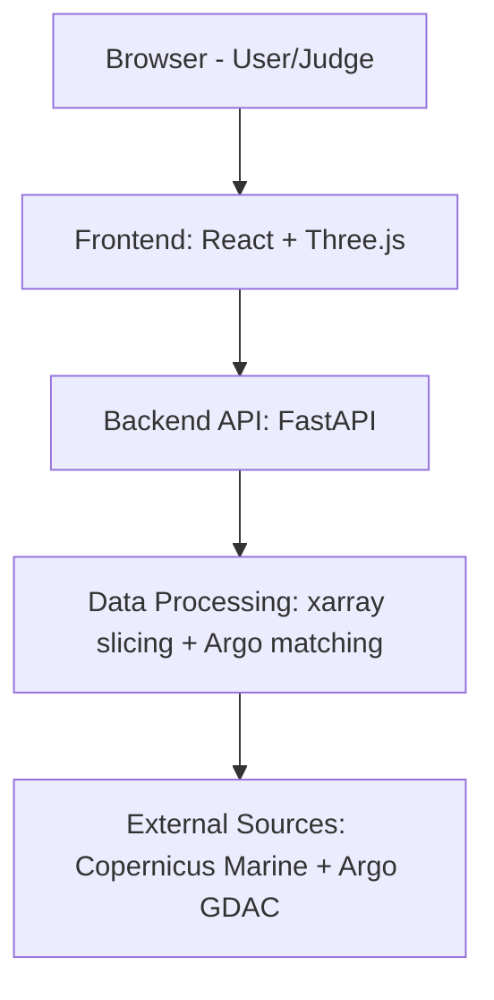
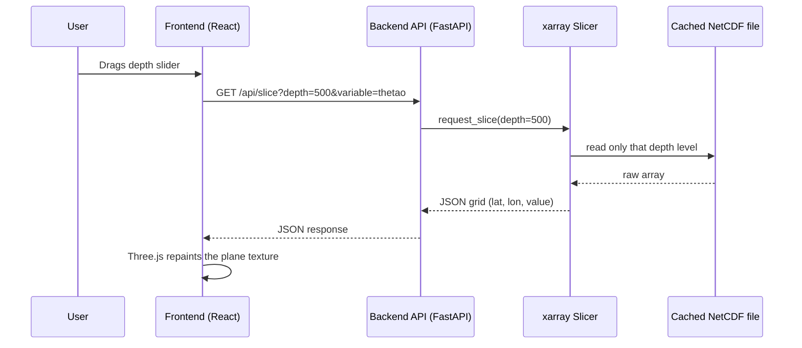

# Ocean 3D Visualization Platform — Architecture & Build Plan
**SIH PS 26067 — INCOIS 3D Ocean Data Visualization System**

> Any AI coding agent working on this repo MUST read this file first, and
> MUST NOT implement a phase that isn't the current target phase.

---

## 1. The Idea, End to End

A judge opens the site in a browser. A rotatable 3D block of the Indian
Ocean EEZ is shown, colored by temperature (warm=red, cold=blue). A depth
slider moves through the water column (0m to -2000m). A time slider/play
button animates several days of forecast data. Small dots on the scene are
real Argo float locations — clicking one opens a chart comparing the real
sensor profile against the model's predicted profile, with an RMSE score.
A toggle switches on animated current-vector particles, driven by real u/v
current data — not decorative motion.

**Non-goals:** photorealistic water, fluid physics, wave/foam shaders.

---

## 2. Dataset — Final Decision

**Model data (temperature, salinity, currents):**
- Source: Copernicus Marine Service
- Product: `GLOBAL_ANALYSISFORECAST_PHY_001_024`
- Variables: `thetao` (temperature), `so` (salinity), `uo`/`vo` (currents)
- Region: lon 68–90, lat 5–22 (India EEZ bounding box) — never pull the
  global file, always subset.
- Access: `pip install copernicusmarine`, free account, `copernicusmarine
  subset` CLI.

**Sensor data (real Argo points):**
- Source: Argo GDAC — `https://data-argo.ifremer.fr`
- Same bounding box and date range as the model subset above, so the
  two are actually comparable (this match is required for Phase 6's RMSE
  to mean anything).

---

## 3. Tech Stack

| Layer | Choice | Why |
|---|---|---|
| Backend | Python, FastAPI | Fast to build, native xarray/NetCDF support |
| Data handling | xarray + netCDF4 | Standard for slicing NetCDF without loading whole file |
| Frontend framework | React + Vite | Fast dev loop, easy state management for sliders |
| 3D rendering | Three.js | Lower-level control than Cesium, lighter for a hackathon MVP |
| Charting | Chart.js | Argo depth-profile charts |
| Data store (Phase 6+) | SQLite or flat JSON | Argo metadata, no need for full PostGIS in MVP |

---

## 4. High-Level Architecture (HLD)



Each layer only talks to the one directly above/below it. The frontend never
touches NetCDF files directly — it only ever sees small JSON payloads.

---

## 5. Low-Level Design (LLD) — Slice Request Flow



This cycle repeats on every slider/time-step change. The full NetCDF file
is opened once and cached server-side (Phase 1) — it is never reloaded per
request, and never sent whole to the browser.

---

## 6. Repository Structure

```
ocean-viz/
├── ARCHITECTURE.md
├── backend/
│   ├── main.py
│   ├── data/                 sample .nc files (gitignored if large)
│   ├── services/
│   │   ├── slicer.py          xarray slicing logic
│   │   └── argo.py            Argo point loading + RMSE calc
│   └── routers/
│       ├── ocean.py           /api/slice, /api/layers
│       └── argo.py            /api/argo, /api/argo/{id}/profile
├── frontend/
│   ├── src/
│   │   ├── App.jsx
│   │   ├── components/
│   │   │   ├── HeatmapCanvas.jsx      Phase 2
│   │   │   ├── OceanScene3D.jsx       Phase 3
│   │   │   ├── DepthTimeSlider.jsx    Phase 4
│   │   │   ├── ArgoOverlay.jsx        Phase 5
│   │   │   └── ProfileChart.jsx       Phase 5
│   │   └── api/client.js
└── PHASE_LOG.md
```

---

## 7. Build Phases

### Phase 0 — Scaffolding
FastAPI `/health` + Vite React app that shows "Backend connected".

### Phase 1 — Data Slicing API
`/api/slice?depth=0&variable=thetao` returns a 2D array from the Copernicus
subset described in §2. Test: numbers look like real temperatures.

### Phase 2 — Flat 2D Heatmap
Render Phase 1's grid as a colored heatmap on canvas. Test: matches known
ocean geography (warm near equator).

### Phase 3 — 3D Depth Stack
`/api/layers` (multiple depths), Three.js planes stacked on Z. Test: rotate
and see colder colors at greater depth.

### Phase 4 — Depth / Time Slider
Interactive control wired to the 3D scene. Test: dragging changes the view
smoothly.

### Phase 5 — Argo Overlay + Profile Chart
`/api/argo`, `/api/argo/{id}/profile` from the Argo GDAC subset. Test: click
a dot, get a sensible depth-vs-temperature chart.

### Phase 6 — Model vs Sensor RMSE
Overlay model profile on the same chart, compute RMSE. Test: value changes
sensibly per float; sanity-check one by hand.

### Phase 7 — Current Vector Particles (the USP)
Particle animation driven by `uo`/`vo`. Test: particles visibly follow the
real current direction, not random motion.

### Phase 8 — Polish & Demo Packaging
Colorbar legend, loading states, `README.md`, `DEMO_SCRIPT.md` (see §8).

---

## 8. Demo Script for Judges (~3 minutes)

1. **Problem (15s)** — "INCOIS scientists use 3 separate tools to compare
   model vs sensor data — we bring both into one browser-based 3D view."
2. **3D scene (30s)** — rotate the ocean block, explain the color scale.
3. **Depth slider (30s)** — drag through depths, colors cool with depth.
4. **Time animation (20s)** — play button, real forecast days, not a loop.
5. **Argo click + RMSE (40s)** — click a float, show model vs sensor lines
   and the RMSE number; explain what it tells a forecaster.
6. **Current particles (20s)** — toggle on, note it's driven by real u/v
   data, not decoration.
7. **Impact line (15s)** — "This turns a multi-tool, multi-minute analysis
   into a single-screen, few-second check — critical during a cyclone or
   fishery advisory."

---

## 9. Agent Working Rules (context retention)

1. Before coding, read `ARCHITECTURE.md` and `PHASE_LOG.md` (if it exists)
   — not the whole codebase.
2. After finishing a phase, append a short entry to `PHASE_LOG.md`: phase
   number, files changed, any deviation from this plan, how to manually
   test it.
3. Only touch files relevant to the current phase, unless fixing a bug
   from a previous phase.
4. No phase should require rewriting a previous phase's files from
   scratch — each phase adds on top of the last.
