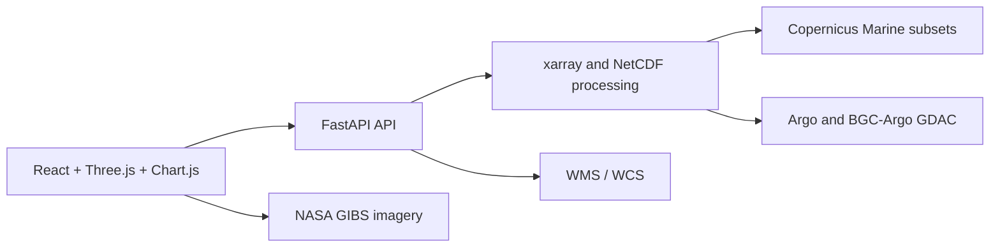

# OceanScope

<p align="center">
  <strong>Browser-native 3D ocean intelligence for the India EEZ</strong><br>
  Explore model fields, real observations, currents, bathymetry, and validation in one traceable workspace.
</p>

<p align="center">
  <a href="https://github.com/Tanishktewetia/incois-ocean-3d-viz/actions"></a>
  <a href="https://github.com/Tanishktewetia/incois-ocean-3d-viz"></a>
  
  
</p>

OceanScope is the implementation for **SIH Problem Statement 26067**. It combines Copernicus Marine model volumes with Argo/BGC-Argo observations, model comparison, scientist uploads, and OGC delivery in a single interactive application.

> **Data integrity first:** rendered scientific values come from real model, observation, bathymetry, satellite, or user-uploaded data. Glider and CTD demonstration points are labelled as sample data and are never presented as live observations.

## Contents

- [Highlights](#highlights)
- [Architecture](#architecture)
- [Data and attribution](#data-and-attribution)
- [Run locally](#run-locally)
- [Deploy to Vercel](#deploy-to-vercel)
- [API](#api)
- [Validation](#validation)
- [Project guide](#project-guide)

## Highlights

| Capability | What it provides |
| --- | --- |
| 3D ocean volume | Temperature, salinity, current magnitude, depth layers, time navigation, opacity, and vertical exaggeration |
| Scientific figures | Layered volume, field relief, and longitude-depth section views |
| Real currents | Animated particles driven by Copernicus `uo` and `vo` fields |
| Instruments | Core Argo, BGC-Argo, and clearly labelled sample Glider/CTD profiles |
| Validation | Click-to-compare model and observation profiles with temperature RMSE |
| Analysis | Marching-cubes isosurfaces and temperature contour overlays |
| Data Lab | Validated NetCDF and instrument uploads, with provenance shown in the UI |
| Interoperability | WMS 1.3.0 and WCS 2.0.1 routes for GIS clients |
| Context | Mission, impact, comparison, and requirement-coverage pages |

## Architecture



The frontend is a Vite application in [`frontend/`](frontend/). The FastAPI application is in [`backend/main.py`](backend/main.py). The Vercel adapter in [`api/index.py`](api/index.py) exposes the same ASGI application as a serverless function.

## Data and attribution

- **Model:** Copernicus Marine `GLOBAL_ANALYSISFORECAST_PHY_001_024`, subset to 68–90°E and 5–22°N.
- **Observations:** Argo GDAC, including BGC-Argo profiles.
- **Bathymetry:** GEBCO gridded bathymetry.
- **Land imagery:** NASA GIBS `MODIS_Terra_CorrectedReflectance_TrueColor`.
- **Cyclones:** GDACS public event API.

The cached NetCDF and Argo files are intentionally excluded from Git because of their size. A deployment needs access to the required files under `backend/data/`, or a separately hosted data-backed API configured through `VITE_RENDER_API_URL`.

## Run locally

### Requirements

- Python 3.11 or newer
- Node.js 20 or newer
- The demo NetCDF and Argo files described in [`ARCHITECTURE.md`](ARCHITECTURE.md)

```powershell
git clone https://github.com/Tanishktewetia/incois-ocean-3d-viz.git
cd incois-ocean-3d-viz

python -m venv backend/.venv
backend/.venv/Scripts/python.exe -m pip install -r backend/requirements.txt
npm install --prefix frontend
```

Start the API and frontend in separate terminals:

```powershell
backend/.venv/Scripts/python.exe -m uvicorn backend.main:app --reload
npm run dev --prefix frontend
```

Open <http://localhost:5173>. Vite proxies `/api`, `/wms`, and `/wcs` to the local API at port 8000.

## Deploy to Vercel

This repository includes [`vercel.json`](vercel.json), [`api/index.py`](api/index.py), and a root [`requirements.txt`](requirements.txt) for Vercel detection.

1. Import the GitHub repository into Vercel.
2. Keep the project root at the repository root. Do not set `frontend` as the Vercel root directory.
3. Deploy. Vercel builds and serves the static React frontend from `public/`.
4. Set `VITE_RENDER_API_URL` to the public HTTPS URL of a separately hosted FastAPI backend so the data and upload features can connect.

For a separately hosted API, set its `FRONTEND_ORIGINS` environment variable to the Vercel URL (for example, `https://your-project.vercel.app`). Multiple origins can be comma-separated.

The Render backend can load demo NetCDF files from a private S3 bucket by setting `AWS_S3_BUCKET`, `AWS_REGION`, `AWS_ACCESS_KEY_ID`, and `AWS_SECRET_ACCESS_KEY`. It falls back to Supabase Storage when S3 is not configured. Keep cloud credentials private and never commit them. Researcher uploads remain local-only and are not copied to either storage provider.

### Important serverless limitation

The Vercel function is a deployment adapter, not a data warehouse. The repository ignores the large NetCDF cache and upload storage, and serverless filesystems are ephemeral. For a production data deployment, host the FastAPI service with persistent data storage, set `VITE_RENDER_API_URL` to its public HTTPS URL, and enable CORS for the Vercel domain. The frontend remains fully Vercel-hosted.

The upload workflow is best suited to local development or a backend with persistent storage. Never commit Copernicus credentials or `.env` files.

Copy [`.env.example`](.env.example) to configure the frontend API base locally or in Vercel project settings.

## API

With the backend running:

| Route | Purpose |
| --- | --- |
| `GET /health` | Service health check |
| `GET /api/layers` | Depth-layer grids and available dates |
| `GET /api/slice` | Single-depth scalar grid |
| `GET /api/currents` | Current vectors |
| `GET /api/argo` | Argo profile catalog |
| `GET /api/instruments` | Unified instrument catalog |
| `POST /api/upload` | Validate a model NetCDF upload |
| `GET /wms` | WMS capabilities and map responses |
| `GET /wcs` | WCS coverage responses |

Interactive OpenAPI documentation is available at <http://127.0.0.1:8000/docs> during local development.

## Validation

```powershell
backend/.venv/Scripts/python.exe -m unittest discover -s backend/tests -v
backend/.venv/Scripts/python.exe -m compileall -q backend api
npm run build --prefix frontend
git diff --check
```

## Project guide

- [`ARCHITECTURE.md`](ARCHITECTURE.md): implementation contract, data sources, phase rules, and scientific scope.
- [`DEMO_SCRIPT.md`](DEMO_SCRIPT.md): five-to-six-minute judge walkthrough.
- [`PHASE_LOG.md`](PHASE_LOG.md): completed phases, verification notes, and known deviations.

## License and source data

This repository contains application code and configuration. Consult each upstream provider's terms and attribution requirements before redistributing downloaded datasets or imagery.
